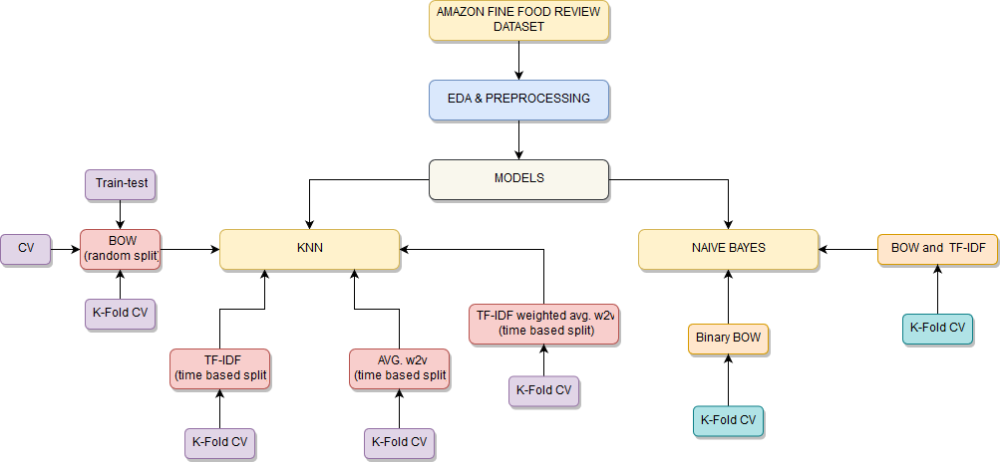

# Amazon fine food review

Amazon fine food review is a data set which consist of the reviews of fine food given by customers on amazon , the reviews are collected from Oct 1999 to Oct 2012 . The task is to perform exploratory data analysis(EDA) and build a model to predict the type of the reviews. The types or the rating system consist of five ways to rate a review , one to five (one being the worst and five being the best) which makes this problem a multi class classification problem . There is another way to solve this problem by considering only two rating ways , one and zero (one -> positive and zero -> negative ) which makes this problem a binary class classification problem . so this repository consist of EDA ,cleaning , preprocessing and models using different machine learning concepts and algorithms . 

### Prerequisites
Basic understanding of python, KNN , keras , Naive Bayes , sklearn , overfitting etc.

### Dataset
Proper description about the data and problem given in the notebook . You can download the dataset from kaggle :- https://www.kaggle.com/snap/amazon-fine-food-reviews 

#### Flow chart

### Agorithms used :
* KNN
* Naive Bayes

One can always try implementing further more algorithms (like Logistic regression or SVM ) with more data points using similar approach to achieve better results.

# PeaceOut ;)
